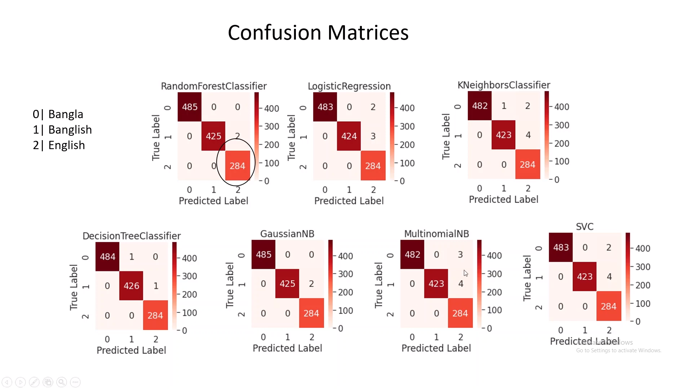

# Social Media App:

I build this app as a part of the learning process of full-stack development.

## Technology Used:
### [Frontend:](https://github.com/kamrul1157024/social-app-client)
 - ReactJs
 - DraftJs ( Rich Text Editor)

### [Backend:](https://github.com/kamrul1157024/social-app-server)

#### Language:
- Java
#### Framework: 
- Spring Boot
#### Testing: 
- JUnit5
- Mockito (For mocking and stubbing)
- MockMvc (For testing API endpoints)
- MockServer (For mocking other service API calls)
#### Database
- PostgreSQL
- JPA with Hibernate as ORM

### [Machine Learning Backend:](https://github.com/kamrul1157024/text-analyzer)

#### Language:
- Python

### Framework:
- Django

## APP 

What can this App do:
- user can create the post in rich text with code snippets
- user can Comment on the post with rich-text
- user can create booklets combining multiple posts
- user can follow each other
- the app can identify political posts using machine learning

If you can understand Bengali you can [watch the video](https://www.youtube.com/watch?v=4KZEpyRTjlI) or read the explanation from below.

I created this app in 1-1.5 months as a pet project for learning. I had planned to add many features like notifications, friend list suggestions using graph DB, Search capability using elastic search. But I thought about stopping it here as it is not giving me considerable benefits for learning new technology.

To run the app in you local your local you need to have docker installed in your system then run the following commands,
you also need to install git-lfs for pulling the serialized machine learning models.

```
sudo apt-get install git-lfs
```

```
mkdir social-media-app
cd social-media-app
git clone git@github.com:kamrul1157024/Social-Media-App.git
git clone git@github.com:kamrul1157024/social-app-server.git
git clone git@github.com:kamrul1157024/social-app-client.git
git clone git@github.com:kamrul1157024/text-analyzer.git
cd Social-Media-App
docker-compose build
docker-compose up -d
```
then go to http://localhost:3080

### How political post-detection works:

In the app, users can only post in Bengali, banglish(Bengali written in English mostly following the Avro way), and English.


The idea is to detect the language first and then run the specific model for a particular language to detect if there are any political contents.

Let say, 

**p(B)** = Probability of post in Bangla language

**p(E)** = Probability of post in English language

**p(BE)** = Probablity of post in Banglish language

probability of post being political, 

&nbsp; &nbsp; &nbsp; &nbsp; **p(P) = p(P &#8745; B) + p(P &#8745; E) + p(P &#8745; BE)**

or, &nbsp; **p(p) = p(B) x p(P|B) + p(E) x p(P|E) + p(BE) x p(P|BE)**

So to detect the political posts, **P(B)** , **P(E)** , **P(BE)** is needed.So to get these values the post is passed to the language detector which uses the multinomial Naive Bias model to figure out this probability.

Now to figure out, the probability of the post being political given that post is in Bengali **(P|B)**  

Same for English.

To detect political posts in Banglish first banglish is converted to Bengali, As people do not type banglish in complete Avro format, a converter dictionary is used to convert typical banglish to Avro Bengali then Avro rules is used to parse banglish from Bengali.

This model should work with mixed language posts.

### Training the model:

#### Language Detector: [[colab-notebook]](https://colab.research.google.com/drive/1JWbZEW2lDJXmZlLLCzAjL7Py7grj8ntF?usp=sharing)


The total number of words for each model is kept almost the same so that it does not create any kind of bias.

Also, There is no banglish data set, so the reverse process is used here to generate the dataset from the Bengali language shown in the picture.

As the dataset is uniform accuracy of the model can be described by precision.



here confusion matrices are not plotted against the number of words they are plotted against the number of sentences as English sentences were long, and they contain lots of words that's why you see the lowest number in the down right corner. But as you can see from the confusion matrix the model was able to detect languages with a very low number of false positive and false negative.


As all of the models are generating high accuracy, I chose the model with the lowest execution time which was Multinomial Naive Bias.

#### Bengali political post: [[colab-notebook]](https://colab.research.google.com/drive/15FutrsFt89BEJixdLltgiDfmwCnHKLTG?usp=sharing)


Here for training prothom alo dataset is used [kaggle](https://www.kaggle.com/twintyone/prothomalo).

Dataset is highly skewed so precision can not be used to choose the model.

As the dataset is highly skewed towards negative value most of the models are giving a high False Negative Rate. But Gaussian Naive Bias seems to perform well here. As it has a higher False Positive Rate than others, so user experience may hamper a bit. But it is better to have an empty house than an ill tenant.

#### English Polititcal post: [[colab-notebook]](https://colab.research.google.com/drive/1cb67o6WK_pw_gJU0snIRE_mzrqI5mf5b?usp=sharing)

For training, BBC Dataset is used [kaggle](https://www.kaggle.com/c/learn-ai-bbc/data)


The process is the same as in Bengali. Here Multinomial Naive Bias and SVC with sigmoid kernel perform well. I choose SVC over Multinomial Naive bias here as it has a lower false-positive rate. Hence, it will increase the user experience.

#### Interaction between App Server and Machine learning Server:

Here banglish to bangle conversion is handled by app server and machine learning server only responsible of execution of machine learning models.


Here when a post is added by the user The app server makes a Rest API Call to the machine learning server to identify the language. It machine learning server identifies language as Banglish then the App server converts it to Bangla. Then sends another request to the machine learning server to identify if the post is political or not. If the post is political then it responds with an error.

